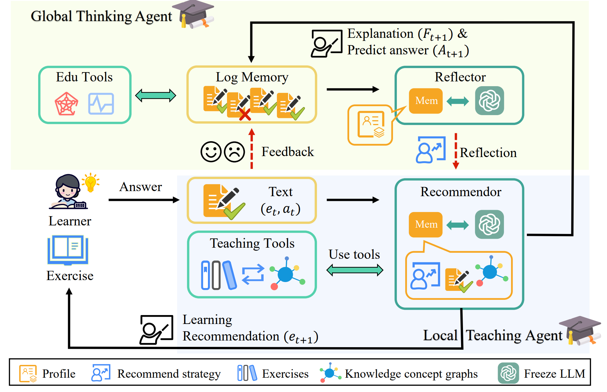

# Codes for GenAL

GenAL: Generative Agent for Adaptive Learning

<!-- 使用 HTML 标签来缩小图片 -->



## Data

You can get ASSIST and Junyi dataset at the following links:

```
ASSIST09:https://sites.google.com/site/assistmentsdata/home/2009-2010-assistment-data
junyi:https://pslcdatashop.web.cmu.edu/DatasetInfo?datasetId=1198
```

## Environment

`conda env create -f environment.yaml`

We use cuda-11.7 version.

## Run

`python ./agents/main.py`

## Prompt templetes

We designed 4 different prompts to test the influency of prompt sensitivity to our GenAL performance.

The part that is used to replace the prompt is the important module to the effectiveness of the recommendation in Local Teaching Agent. It should be note that, the original prompt is designed by educational expert and the other is re-writed by ChatGPT, aiming to enhance reasoning effectiveness.


Original Prompt in our paper:

> "Given the following history text: {history_text[-5:]} and the recommand reflection {recommend_reflection}, the student profile: {student_profile}, the knowledge learning goal: {learning_goal}. Here are the candidate question list: {candidates}. Please provide the most suitable question from above list, that can help the student to achieve the learning goal efficiently. For example, the output format should be :['question_id': 'xxx', 'recommand_reason': 'recommand reason details', 'predict_answer': 'True' or 'False'], except this format, please do not output anything."

The prompt we used to re-write:

> Here is a prompt template. Please rewrite three additional prompt templates to make the model's reasoning as effective as possible.
>
> "Given the following history text: {history_text[-5:]} and the recommand reflection {recommend_reflection}, the student profile: {student_profile}, the knowledge learning goal: {learning_goal}. Here are the candidate question list: {candidates}. Please provide the most suitable question from above list, that can help the student to achieve the learning goal efficiently. For example, the output format should be :['question_id': 'xxx', 'recommand_reason': 'recommand reason details', 'predict_answer': 'True' or 'False'], except this format, please do not output anything."

P1:

> "Based on the following history text: {history_text[-5:]}, the recommended reflection: {recommend_reflection}, the student profile: {student_profile}, and the knowledge learning goal: {learning_goal}, evaluate the candidate question list: {candidates}. Select the question that will most effectively aid the student in reaching the learning goal. Structure the response as: ['question_id': 'xxx', 'recommend_reason': 'reason for recommendation', 'predict_answer': 'True' or 'False']. No other output beyond this format is allowed."

P2:

> "Considering the provided history text: {history_text[-5:]}, the recommended reflection: {recommend_reflection}, the student profile: {student_profile}, and the learning goal: {learning_goal}, review the list of candidate questions: {candidates}. Choose the question that best aligns with the learning goal and provides the most efficient path for student achievement. Your response should only follow this format: ['question_id': 'xxx', 'recommend_reason': 'explanation of the choice', 'predict_answer': 'True' or 'False']—no additional information outside this format."

P3:

> "Given the last five entries of the history text: {history_text[-5:]}, the reflection recommendation: {recommend_reflection}, the student profile: {student_profile}, and the targeted learning goal: {learning_goal}, analyze the candidate question list: {candidates}. Select the most appropriate question to help the student efficiently achieve the learning objective. The response should strictly adhere to this format: ['question_id': 'xxx', 'recommend_reason': 'justification for the recommendation', 'predict_answer': 'True' or 'False']. Do not include any content beyond this."
